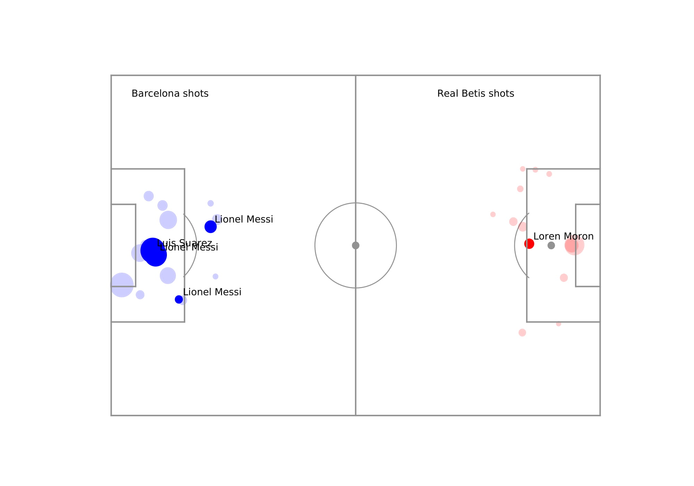
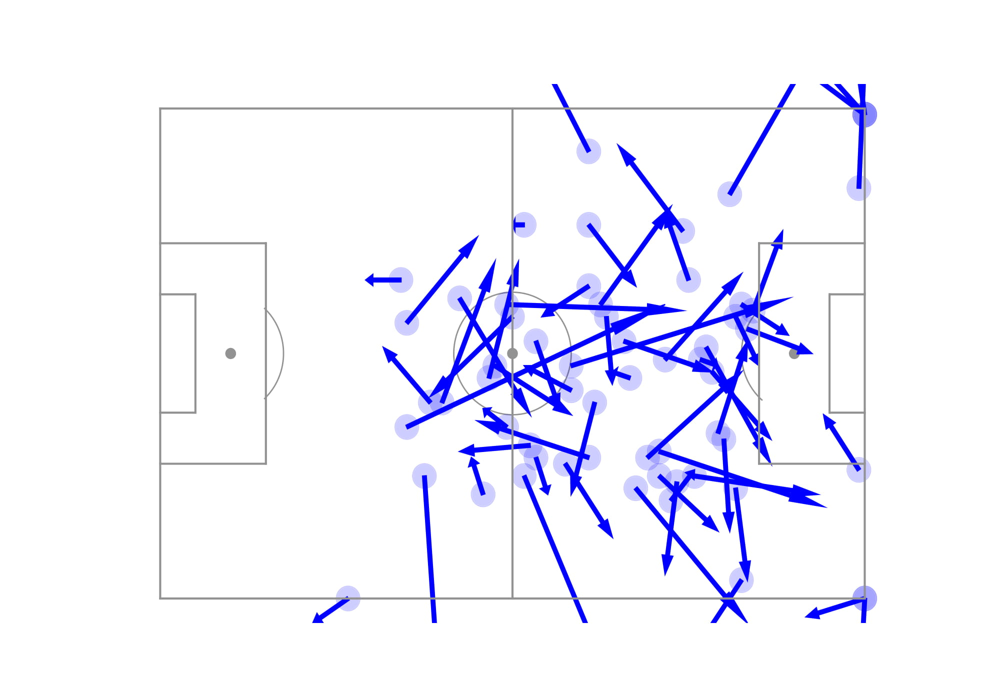

# An attempt at understanding Soccer Analytics

This repo aims at understanding some of the mathematical / player evaluation models and attempts to implement them. 

My initial implementation will be on Real Betis vs FC Barcelona in 2018 at the Benito Villamarin

## Data

The data used here is a sample from the Statsbomb event tracking data, uploaded on the Statsbomb website to be used for research purposes.

## Shot Map

This is a sample shot map from Real Betis vs Barcelona in 2018. Circles represent positions from where shots were taken and highlighted circles represent goals.

Here the area of the circle represents the xG of the shot. Surprisingly both teams missed some shots with high xG. The match ended 1-4 in favour of Barcelona, with Messi getting a hat-trick, Suarez finishing off a brilliant solo move and Loren Moron getting one for the home side.

## Pass-Map

Here is the pass map of Lionel Messi from this match.

The positions Messi takes up in this game is quite incredible. He has a few passes from inside his own half and also covered most of the opposition's half too. Some quality playmaking there.

The passes going out of the pitch are deflections off Messi/passes misplaced by Messi that went out of play.
